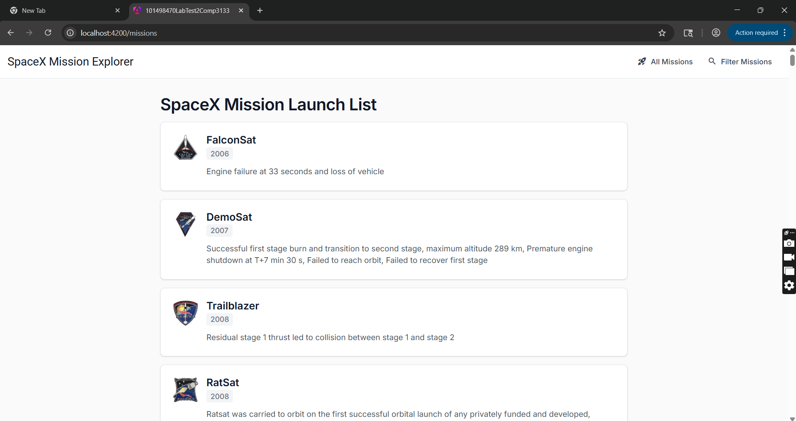
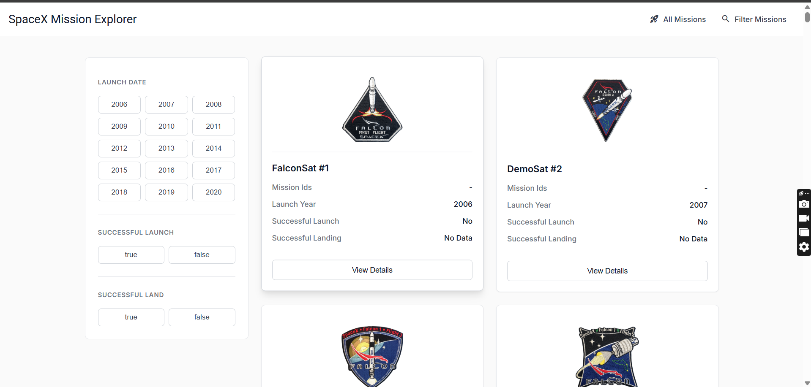
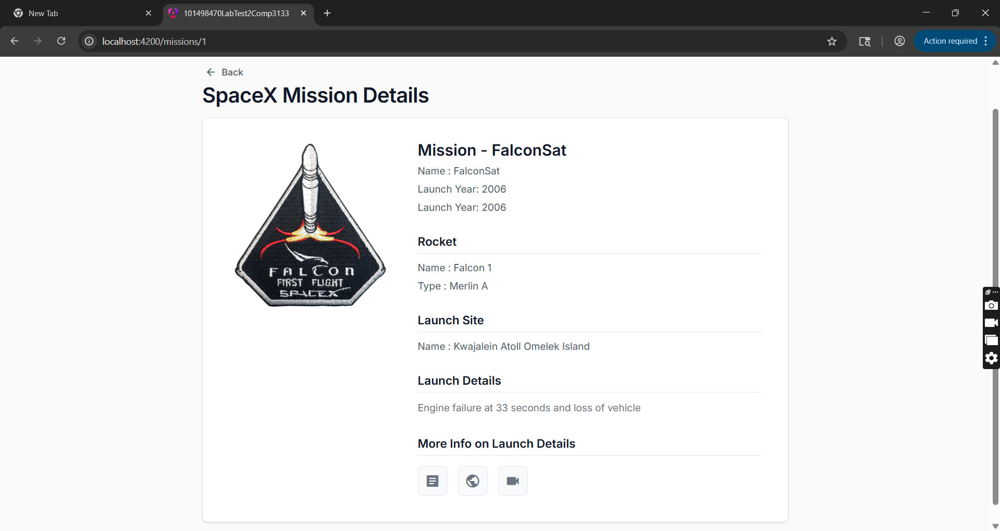

# SpaceX Mission Explorer - COMP3133 Lab Test 2

## App description
This is a modern Angular application built to explore and filter SpaceX missions using the public SpaceX REST API. Designed with a sleek, minimalist, and highly professional layout using Angular Material, it gives users an interactive interface to browse historical SpaceX launches. It integrates complex requirements such as dynamic API parsing for nested properties, rigorous component routing, error boundary management, and strict TypeScript modeling. 

## Features implemented
1. **App-Root Navigation Strategy**: Core Angular Router utilization allowing instantaneous component switching between full mission lists and dashboard filters.
2. **SpaceX API Search & Filter Service**: An injected service retrieving data externally from SpaceX. The application parses and matches boolean payload metadata specifically for tracking exact successful landing histories and targeted launch years. 
3. **Mission List View (`@for`)**: Retrieves and loops through all SpaceX missions, presenting clean glass-inspired Material cards dynamically.
4. **Mission Filter Dashboard**: Incorporates a 3-column UI split mapping direct values. Users can select Launch Years (2006 to 2020) and success parameters safely via state management using Angular Signals.
5. **Detailed Routing & Deep Linking (`@switch`)**: Deep links parse specific unique `flight_number` IDs from the ActiveRoute snapshot, allowing the user to view an isolated mission environment. The rocket generations are distinctly color-coded in real-time utilizing the new `@switch` control flow syntax.
6. **State-of-the-Art Angular 19+ Syntax**: Refactored entirely outside of legacy Angular boundaries—incorporating `zone.js` bootstrapping, signal-based Reactivity, and `@if / @for` component flows.

## Screenshots of the application with description

> **Note to self:** Be sure to create a folder named `screenshots/` in this repository and upload your own images matching these names before your final submission!

### 1. Running Application (Main List)

*Description: The main landing page presenting the core 'SpaceX Mission Launch List'. This fulfills the requirement showing the application running successfully with data retrieved from the API.*

### 2. Output UI (Filter Dashboard)

*Description: The Mission Filter component featuring the sidebar dashboard. This demonstrates filtering missions exclusively by their exact parameters such as launch year and successful conditions.*

### 3. Source Code Architecture & Details View

*Description: The internal Mission Detail view demonstrating routing state alongside screenshots of the Service and TypeScript models governing the API hook.*

## Instructions to run the project
To run this application locally on your machine, follow these steps:

1. **Verify Node.js is installed**: Open a terminal and run `node -v` and `npm -v`. Make sure you are on a relatively modern version of Node. 
2. **Clone the repository**:
   ```bash
   git clone https://github.com/Idrishkaidawala/101498470_labtest2_comp3133.git
   cd 101498470_labtest2_comp3133
   ```
3. **Install Dependencies**:
   ```bash
   npm install
   ```
4. **Deploy the Local Development Server**:
   ```bash
   ng serve --open
   ```
   *The `--open` flag will automatically launch a tab in your default browser directed to `http://localhost:4200`.*
